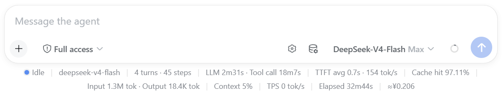
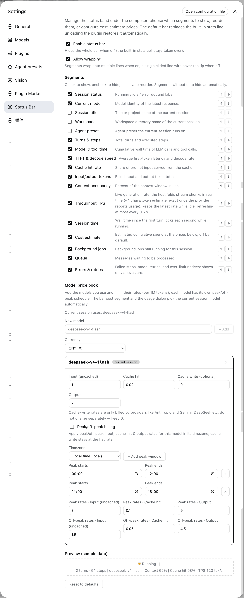
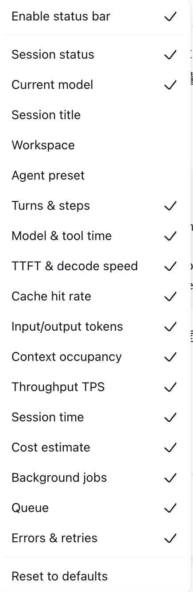
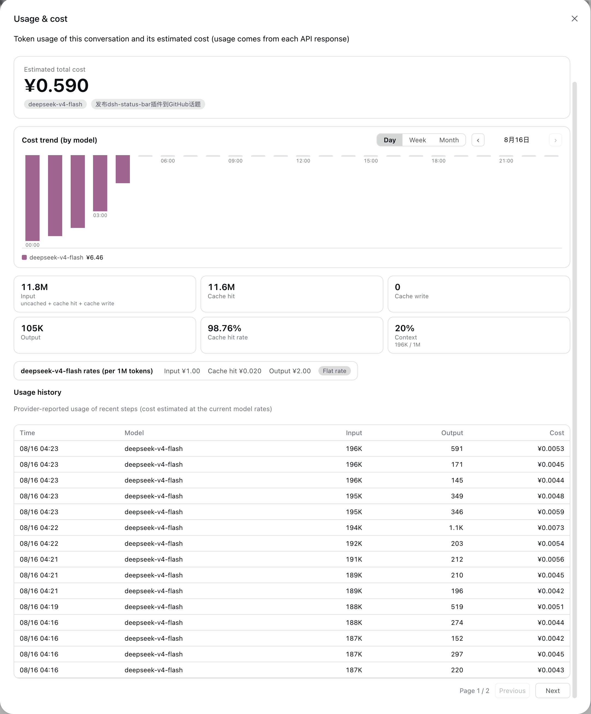

# dsh-status-bar · Know what your agent is doing — at a glance

> **✅ Adapted to the DSH desktop app — DSH `0.2.0-rc.2`.**
> **The `0.2.x` line is built for the desktop runtime: install it into the `desktop` profile (in-app **Plugins** page, or `dsh plugin --profile desktop add …`).**
> **The retired `0.1.x` line targets the old `0.1.x` runtime and will NOT load on the 0.2.0 desktop.**

[](https://github.com/deepseek-ai/deepseek-harness) [](https://github.com/Starlight-bananice/dsh-status-bar/releases) [](https://www.npmjs.com/package/@bananiceee/dsh-status-bar) [](LICENSE) [](https://github.com/topics/dsh-plugin) [](https://awesome-dsh-plugin.com)

[English](README.md) · [中文](README.zh.md)

---

## Overview

**The problem:** the native DSH bottom status bar is one long, fixed line — the more it shows, the more it overflows, and on narrow windows parts of it get **truncated**. You cannot see the current model, how full the context window is, how fast tokens are streaming, or what a session has cost — and there is no way to arrange that information the way you work.

**Who it is for:** anyone running the DSH desktop app daily — power users and teams who want live session telemetry without leaving the composer, and without running a separate monitor.

**What it does:**

- **Desktop-native, not bolted on** — **rebuilt against the DSH 0.2.0 desktop runtime** (`@deepseek-ai/dsh-*@0.2.0-rc.2`): session facts come from the desktop's own Chat / session / composer services, background jobs from its job service, and the live throughput figure from its own streaming event window. No shims, no legacy compatibility path.
- **Near-native experience, fully yours** — 16 toggleable, reorderable segments: status dot, model, title, workspace, turns & steps, model/tool time, TTFT & decode speed, cache-hit rate, tokens, context pressure, live TPS, session time, cost estimate, jobs, queue, errors
- **Live throughput (TPS)** — the bar folds this session's own live stream in the browser, so the speed updates chunk by chunk while streaming and tracks the real generation rate regardless of how finely the stream is delivered; no polling, no host round-trip, no external live-stats plugin
- **Cost estimation with a user-maintained model price book** — per-model rates, per-model peak/off-peak schedules, **each message/step priced with the model that actually produced it** (input, cache-hit, cache-write and output priced separately at that step's own time), and a «Usage & cost» dialog with a stacked cost-trend chart (day / week / month), a paged per-step usage history (with a dedicated cache-hit column), and a total-cost hero
- **Zero-config default** — 13 segments ship enabled; everything else is a checkbox away
- **Useful options** — multi-line wrapping (so nothing gets truncated), per-model cost estimation with peak/off-peak pricing, currency choice (CNY / USD), a quick-toggle gear menu, and a dedicated settings page with one-click reset
- **Clean takeover** — the plugin's bar shadows the built-in `stats` cell at lower priority: while loaded it renders, when unloaded the built-in line returns untouched
- **Bilingual UI** — client locale strings ship for English and Chinese, following the DSH locale system

## Screenshots

The status bar replaces the built-in stats line with near-native live session telemetry (status · model · turns · context · cache · TPS · session time · jobs · queue · errors), managed from a dedicated settings page — including a per-model price book with peak/off-peak pricing:





| Toggle & reorder on the go (segment list) | Usage & cost dialog (trend chart · stat cards · history) |
|---|---|
|  |  |

## Compatibility

| Item | Value |
|---|---|
| **DSH desktop app** | **`0.2.0-rc.2` — the target of this line; verified 2026-10-01** |
| **Plugin line** | **`0.2.x` for the desktop runtime. `0.1.x` targets the retired `0.1.x` runtime and will not load on the 0.2.0 desktop.** |
| DSH profile | `desktop` for the packaged app · `web` for a self-hosted `dsh web` · `headless` for the CLI runtime |
| Runtime | Node ≥ 22 (host) + modern browser (client); no external services |
| Peer relation | Independent of every other status/TPS plugin: the live rate is folded client-side from this session's own event window, so this plugin registers **no** shared projection key — no peer's key, `stateVersion`, or registration order can displace the bar's TPS |

### What the desktop port changed (0.2.0)

DSH 0.2.0 removed `@deepseek-ai/dsh-client-runtime` and split what the old Conversation snapshot carried. This line ports the plugin to that shape:

- **Session data moved.** Nodes, turn timings, the streaming partial and running tool calls now come from the Chat target (`useChat`), lifecycle facts (`running`, `lastAgentError`) from the session snapshot (`useSession`), and the queued-message count from the composer inbox (`useInput`).
- **Jobs came from a removed field.** `SessionListState.jobsBySession` is gone; the jobs segment now reads the client job roster (`ctx.jobs`), the same source as the desktop's own session-header job list.
- **Live TPS moved into the browser.** 0.2.0 has no durable `assistant/chunk` event, so the host projection that used to serve the rate no longer receives input. The bar folds the session's own live stream client-side instead — same estimator, and a trailing-window rate measurement that no longer depends on how finely the stream is delivered.
- **The `agent preset` segment was retired** (`SessionSummary.agentPreset` no longer exists; 0.2.0 exposes the preset only to the new-session hero chip). It was off by default, and any saved configuration that still lists it is filtered out on load.
- **Build no longer needs a DSH source checkout.** The DSH packages the plugin compiles against are pinned devDependencies at `0.2.0-rc.2`; `pnpm install && pnpm run build` is the whole story.

## Install

Every install path below targets one DSH profile. The packaged desktop app runs the profile named **`desktop`**; a self-hosted `dsh web` normally runs `web`.

### Desktop app — in-app (easiest)

1. Open the **Plugins** page in the left sidebar.
2. Click **Add plugin**, enter the package name `@bananiceee/dsh-status-bar`, and confirm with **Install**.
3. Click **Enable now** when the install finishes.
4. If the dialog says the change takes effect on the next launch, restart the app.

Installing from inside the app writes to the same profile a terminal command would, so the two paths below are interchangeable.

### Desktop app — from a terminal

```sh
# latest release of the desktop line
dsh plugin --profile desktop add @bananiceee/dsh-status-bar

# or pin the exact version
dsh plugin --profile desktop add @bananiceee/dsh-status-bar@0.2.2
```

### Self-hosted Web / CLI

```sh
dsh plugin --profile web add @bananiceee/dsh-status-bar@0.2.2
```

### Other sources

```sh
# A local checkout (profile assembly)
dsh plugin --profile desktop add ../dsh-status-bar

# The GitHub repository
dsh plugin --profile desktop add github:Starlight-bananice/dsh-status-bar

# A pinned release tarball — immutable and versioned (attached to every
# GitHub release; handy when git access to the repo is awkward)
dsh plugin --profile desktop add https://github.com/Starlight-bananice/dsh-status-bar/releases/download/v0.2.2/bananiceee-dsh-status-bar-0.2.2.tgz
```

> **Note:** pnpm 11 enforces a 24 h `minimumReleaseAge` for freshly published packages — if a same-day release is rejected, append `--config.minimumReleaseAge=0` to the `dsh plugin add` command.

> **Note:** pnpm fetches GitHub-hosted packages from `codeload.github.com` and does not read your git proxy config. If the install hangs or fails with a network error (e.g. `error (23)`), export an HTTP(S) proxy: `export HTTPS_PROXY=http://127.0.0.1:7890 HTTP_PROXY=http://127.0.0.1:7890` and re-run.

> **Since v0.1.5:** the built `lib/` artifacts are committed to the repository — a git install is ready to run immediately, **no build step required**. Add the plugin, restart the app, done.

### Upgrade

```sh
# npm installs: update straight to the latest registry version
dsh plugin --profile desktop update @bananiceee/dsh-status-bar

# or re-add a pinned version (the in-app page currently has no auto-update:
# uninstall, then install the new version)
dsh plugin --profile desktop add @bananiceee/dsh-status-bar@0.2.2

# github: installs — pnpm pins a ref-less `github:` dependency to the commit
# resolved at install time, so `dsh plugin update github:...` reports
# "Already up to date" and keeps the old build. Upgrade with a re-add:
dsh plugin --profile desktop remove @bananiceee/dsh-status-bar
dsh plugin --profile desktop add github:Starlight-bananice/dsh-status-bar#v0.2.2
```

### Disable

- **Hide the bar only** — the client master switch (Settings → Status Bar, or the gear menu in the composer) turns the bar off instantly; the host projections and the usage ledger keep running.
- **Stop the plugin entirely** — disable it on the in-app **Plugins** page (or remove it from the profile's `bundles` list); re-enabling restores it.

### Uninstall

```sh
dsh plugin --profile desktop remove @bananiceee/dsh-status-bar
```

Removal restores the built-in stats line automatically (the shadow cell is released). **Data left behind:** browser `localStorage` (`dsh.statusBar.v1`) and the host usage file (see [Permissions & data](#permissions--data)) are not deleted — remove them manually for a clean slate.

## Quick start

1. Install (above) and restart the app if the installer asks for it.
2. Start a session — the bar shows status · model · turns · durations · speeds · cache hit · tokens · context · TPS · session time · jobs · queue · errors by default.
3. Open **Settings → Status Bar** (its own section in the Settings nav, labeled `Status Bar`) to toggle/reorder segments, enable wrapping, or reset.
4. Want cost estimates? Add the models you use to the **model price book**:

   ```sh
   # In Settings → Status Bar → Model price book:
   # model "deepseek-chat" → input 2 / cache read 0.5 / cache write 2 / output 8 (CNY per 1M tokens)
   # optional: enable peak/off-peak with DeepSeek's official windows 09:00–12:00, 14:00–18:00
   ```

   The bar then shows e.g. `≈¥0.0123` for the current session; the figure is the sum of each model's usage × that model's own price (so switching models mid-session prices each part with its own rate). Click the chart button next to the gear to open the usage & cost dialog (stat cards, rate card, a paged usage history — 20 rows per page, up to 10 pages — with input / cache-hit / output / cost columns, and a per-model cost-trend chart with ‹ › period navigation).

## Configuration

All configuration is client-side, stored in browser `localStorage` under **`dsh.statusBar.v1`**, edited via the settings page or the in-composer gear menu.

| Option | Default | Meaning |
|---|---|---|
| `enabled` | `true` | Master switch; `false` hides the bar entirely |
| `wrap` | `true` | Allow the bar to wrap onto multiple lines within the input card's width instead of eliding (the bar never runs past the input box's edges in either mode) |
| `segments` | 13 on / 3 off (see below) | Ordered list of enabled segments |
| `cost.currency` | `CNY` | Currency for cost display (`CNY` / `USD`) |
| `cost.models` | `{}` | User-maintained model price book (model id → prices + schedule) |

**Default segment state:** on — status, model, counts, durations, speeds, cache hit, tokens, context, TPS, session time, jobs, queue, errors; off — title, workspace, cost.

**Model price book entry** (values added when a model is configured): input `2`, cache read `0.5`, cache write `2`, output `8` (per 1M tokens, in the configured currency); peak/off-peak disabled by default; when enabled, defaults to DeepSeek's official windows `09:00–12:00`, `14:00–18:00`, timezone `local`.

**Environment variables:** `DSH_HOME` (host-side) — base directory for the plugin's local data (default `~/.dsh`). No other env vars, no secrets, no tokens.

**Segment reference** (all 16, toggleable & reorderable):

| Segment | Shows | Source |
|---|---|---|
| Status | ● running / idle / error dot | session snapshot `running` / `lastAgentError` + chat `partial` / `runningCalls` |
| Model | model of the latest response | `sessionModel` projection (host fold of assistant/message events) |
| Title | session title (truncated) | `SessionSummary.displayTitle` |
| Workspace | workspace dir name | `SessionSummary.cwd` |
| Turns & steps | N turns · M steps | `sessionStats` projection (window-fold fallback) |
| Model & tool time | LLM · tool-call wall time | `sessionStats` |
| TTFT & decode | avg first token · tok/s | `sessionStats` |
| Cache hit | prompt cache-hit share (2 decimals, capped at 99.99%) | `tokenUsage` |
| Tokens | billed input/output totals | `tokenUsage` |
| Context | context-window occupancy % | `contextPressure` |
| Throughput TPS | live generation rate (default on) | client fold of the session event window (`assistant/live-chunk`); block-aware token estimation (~4 chars/token + block/role framing, re-priced at `block-end`), measured over a trailing 1.5 s window so the figure is independent of stream granularity; switches to the provider-reported rate once exact usage lands, and reports 0 while the session is not generating |
| Session time | wall clock, ticks while running | chat `turnTimings` |
| Cost estimate | ≈¥0.0123 (off by default) | `sessionUsage` projection — each model's usage × its own effective price (flat or peak/off-peak at `now`), summed across models |
| Jobs | running background jobs | `ctx.jobs` roster (same source as the desktop's session-header job list) |
| Queue | queued messages | composer inbox (`useInput` → `queue`) |
| Errors | failed/retried/over-limit count (>0 only) | chat node fold |

## Permissions & data

| Category | What the plugin touches |
|---|---|
| Files | Host writes the usage ledger to `<DSH_HOME>/dsh-status-bar/usage.jsonl` (`~/.dsh/dsh-status-bar/usage.jsonl` by default; one record per assistant message: timestamp, model, input/cacheRead/cacheWrite/output tokens). In-memory history is a rolling 120-day window. |
| Network | **No outbound requests, ever.** The only endpoint is the plugin's own local webserver route `/status-bar/api/usage` (same origin as the DSH web UI, `127.0.0.1`), serving the chart buckets. |
| Credentials | **None.** The plugin never reads, stores, or transmits API keys, tokens, or cookies. |
| User data | Client: `localStorage["dsh.statusBar.v1"]` (bar config + price book — no conversation content). Host: the usage ledger described above (token counts only, no prompts, no messages, no file contents). |

## Troubleshooting

| Symptom | Cause & fix |
|---|---|
| The bar does not appear | Master switch off → enable it in Settings → Status Bar, or via the gear menu. `localStorage` cleared? Config resets to defaults. On a fresh install, restart the app once. |
| Nothing loads after upgrading from 0.1.x | Expected — the `0.1.x` line cannot run on the 0.2.0 desktop. Uninstall it, then install `0.2.x` into the `desktop` profile. |
| TPS segment is 0 / blank | No stream has started yet in this session, or the stream has settled (no active generation reads as 0 by design). The measurement window restarts on each retry. |
| TPS conflicts with another plugin | None by design — this plugin registers **no** shared projection key. The live rate is folded client-side from this session's own event window, so another status/TPS plugin cannot displace or shadow it. |
| Cost estimate missing | None of the session's models is in the price book (or they are all zero-priced) → add them in Settings → Status Bar → Model price book. Costs are estimated at the book's rates (per model, flat or peak/off-peak), not provider billing. |
| Usage chart is empty | No assistant messages with provider-reported usage in the period yet, or `DSH_HOME` points elsewhere than expected (check the `usage.jsonl` location above). |
| UI looks broken after an upgrade | Hard-refresh the window (stale client bundle) and verify the plugin version on the in-app **Plugins** page. |
| Can't tell which version is installed | From a terminal (macOS/Linux): `node -p "require(process.env.HOME + '/.dsh/profiles/desktop/node_modules/@bananiceee/dsh-status-bar/package.json').version"` — use `web` instead of `desktop` for a self-hosted web profile. |

**Logs:** the plugin writes no log files of its own — host-side diagnostics appear in the DSH host process output, client-side issues in the browser devtools console.

**Rollback:** the settings page has a one-click **Reset** (restores all defaults). For the plugin itself, uninstall → re-add the previous version with `dsh plugin --profile desktop add <pkg>@<version>`; the built-in stats line is always restored automatically on removal.

## Development

```sh
pnpm install            # devDependencies: typescript / tsdown / react / @types AND the DSH packages this plugin compiles against (pinned @deepseek-ai/*@0.2.0-rc.2)
pnpm run build          # host tsc → lib/, client declarations → lib/types/client, tsdown → lib/client.js
pnpm run typecheck:client   # client typecheck only
pnpm run verify         # rebuild and fail if the committed lib/ drifted from src/
```

Build artifacts under `lib/` are **committed** (since v0.1.5), so plain git installs work without any build step; the commands above exist to refresh the artifacts before a release. Nothing here needs a DeepSeek Harness source checkout any more: every `@deepseek-ai/*` package the plugin compiles against is a pinned devDependency, resolved from this package's own `node_modules`. Host-side sources are plain TypeScript (Cordis plugin), client sources are React + the DSH client UI slots.

**Keeping `lib/` in sync:** run `pnpm install --frozen-lockfile` (reproducible rebuilds use the exact toolchain pinned in `pnpm-lock.yaml`), then `pnpm run verify` before pushing (`scripts/verify.sh` rebuilds host + client and fails when the committed `lib/` drifted from `src/`). The repository also ships a pre-push hook that runs it automatically whenever a push touches `src/` or the build config — enable it once with:

```sh
git config core.hooksPath .githooks
```

The `lib-sync` GitHub Actions workflow enforces the same invariant in CI: a fast artifact-integrity check on every push/PR, plus a full rebuild-vs-`lib/` drift check on PRs that touch `src/` and on manual dispatch.

**Contributing:** fork the repository, branch off `main`, and open a PR — small, focused changes with a clear description are preferred. Report bugs via Issues with the DSH version (desktop app version included), browser, and a minimal repro.

## License & security

- **License:** [MIT](LICENSE) (© 2026 Starlight-bananice).
- **Security:** this plugin holds no credentials and makes no network calls; the attack surface is the DSH host process itself. To report a security issue privately, use GitHub's **Security Advisories** on this repository (https://github.com/Starlight-bananice/dsh-status-bar/security/advisories/new) — do not open a public issue for vulnerabilities.
