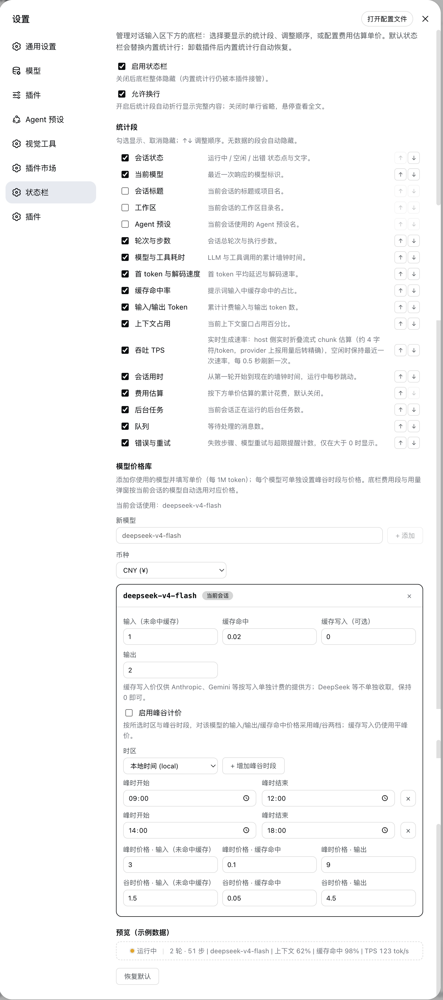
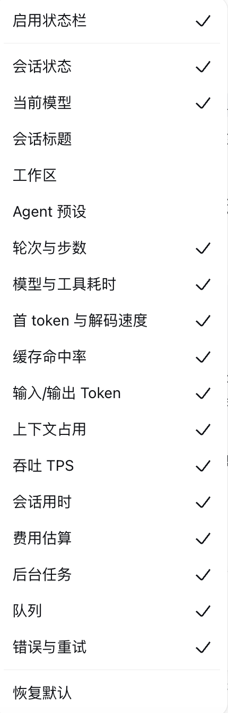
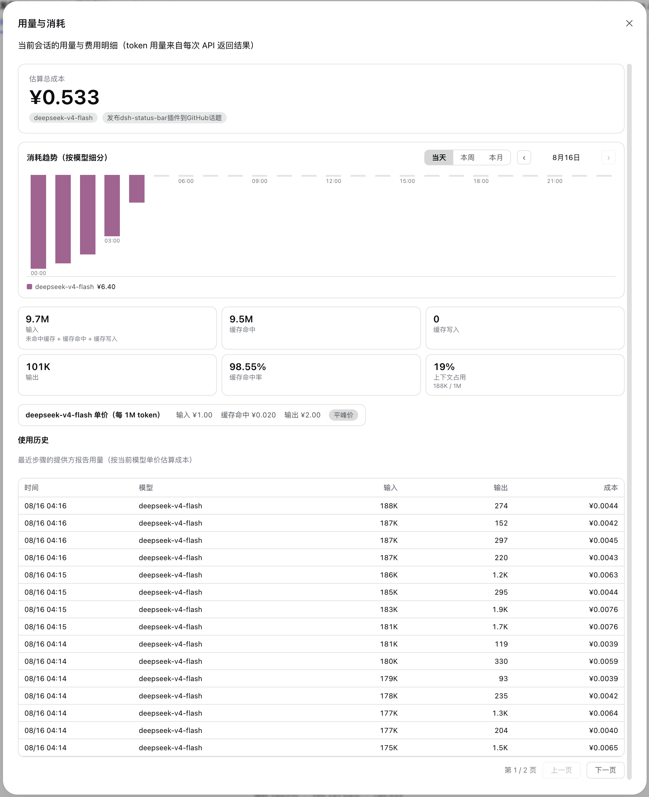

# dsh-status-bar · 一眼看清你的 agent 正在做什么

> **✅ 已适配 DSH 桌面版 —— DSH `0.2.0-rc.2`。**
> **`0.2.x` 版本线面向桌面版运行时：请把它安装到 `desktop` profile（应用内「插件」页，或 `dsh plugin --profile desktop add …`）。**
> **已停止维护的 `0.1.x` 版本线面向旧的 `0.1.x` 运行时，无法在 0.2.0 桌面版上加载。**

[](https://github.com/deepseek-ai/deepseek-harness) [](https://github.com/Starlight-bananice/dsh-status-bar/releases) [](https://www.npmjs.com/package/@bananiceee/dsh-status-bar) [](LICENSE) [](https://github.com/topics/dsh-plugin) [](https://awesome-dsh-plugin.com)

[English](README.md) · [中文](README.zh.md)

---

## Overview（概览）

**问题所在：** DSH 原生底部状态栏是一条超长的固定统计行——内容一多就会溢出，窗口一窄还会有部分内容被**截断**。你看不到当前模型、上下文窗口占用多少、Token 流式生成有多快、这个会话花了多少钱，也没法按自己的工作习惯排列这些信息。

**适合谁：** 每天使用 DSH 桌面版的用户——希望不离开输入栏就能掌握会话实时状态，又不想额外开一个监视器的重度用户与团队。

**核心能力：**

- **桌面版原生，而非外挂** —— **针对 DSH 0.2.0 桌面版运行时重建**（`@deepseek-ai/dsh-*@0.2.0-rc.2`）：会话事实来自桌面版自身的 Chat / 会话 / 输入框服务，后台任务来自其任务服务，实时吞吐数字来自其自身的流式事件窗口。没有兼容垫片，也不保留旧版兼容路径。
- **接近原生体验，且完全由你掌控** —— 16 个可开关、可排序的信息段：状态点、模型、标题、工作区、轮次与步数、模型/工具耗时、TTFT 与解码速度、缓存命中率、Token、上下文占用、实时 TPS、会话时长、费用估算、任务、队列、错误
- **实时吞吐（TPS）** —— 底栏在浏览器内直接折叠本会话自己的实时流，流式生成期间速度随分块逐块刷新，无论流以多细的粒度送达都能反映真实生成速率；无需轮询、无需 host 往返，也无需外部 live-stats 插件
- **费用估算 + 用户维护的模型价格手册** —— 每个模型独立的价格与峰/谷时段，**每条消息/每一步都按实际产出它的模型计价**（输入、缓存命中、缓存写入、输出四类分别按该步发生时刻取价）；「用量与费用」弹窗内置堆叠费用趋势图（日 / 周 / 月）、分页的逐步用量历史（含独立的缓存命中列）与总成本展示
- **零配置开箱即用** —— 13 个信息段默认开启，其余勾选即得
- **多项实用选项** —— 多行换行显示（内容再多也不会被截断省略）、逐模型费用估算（支持峰谷计价）、币种切换（CNY / USD）、齿轮快捷开关菜单，以及带一键重置的专属设置页
- **干净的接管机制** —— 插件底栏以低优先级遮蔽内置 `stats` 单元格：加载期间由其渲染，卸载后内置统计行原样恢复
- **双语界面** —— 客户端文案内置英文与中文，遵循 DSH locale 体系

## Screenshots（界面预览）

以接近原生的底栏替换内置统计行，实时呈现会话状态（状态 · 模型 · 轮次 · 上下文 · 缓存 · TPS · 会话时长 · 任务 · 队列 · 错误），并由专属设置页统一管理——含逐模型价格手册（支持峰谷计价）：




| 随时开关与排序（信息段列表） | 用量与费用弹窗（趋势图 · 统计卡 · 历史） |
|---|---|
|  |  |

## Compatibility（兼容性）

| 项目 | 说明 |
|---|---|
| **DSH 桌面版** | **`0.2.0-rc.2`——本版本线适配的目标；最后验证于 2026-10-01** |
| **插件版本线** | **`0.2.x` 面向桌面版运行时。`0.1.x` 面向已停止维护的 `0.1.x` 运行时，无法在 0.2.0 桌面版上加载。** |
| DSH profile | 打包桌面应用使用 `desktop` · 自建 `dsh web` 使用 `web` · CLI 运行时使用 `headless` |
| 运行环境 | Node ≥ 22（host）+ 现代浏览器（client）；无外部服务依赖 |
| 共存关系 | 与任何其他状态栏/TPS 插件互不干扰：实时速率在客户端折叠本会话自己的事件窗口，因此本插件**不注册任何共享投影键**——任何对等插件的键名、`stateVersion` 或注册先后都无法顶掉底栏的 TPS |

### 桌面版移植改了什么（0.2.0）

DSH 0.2.0 移除了 `@deepseek-ai/dsh-client-runtime`，并把旧 Conversation 快照承载的数据拆到了不同位置。本版本线即针对该结构完成移植：

- **会话数据搬家。** 消息节点、轮次时间、流式 partial 与运行中的工具调用现在来自 Chat 目标（`useChat`），生命周期事实（`running`、`lastAgentError`）来自会话快照（`useSession`），排队消息数来自输入框收件箱（`useInput`）。
- **后台任务来自一个已被移除的字段。** `SessionListState.jobsBySession` 已不存在；任务段现在读取客户端任务花名册（`ctx.jobs`），与桌面版自身的会话头部任务列表同源。
- **实时 TPS 移入浏览器。** 0.2.0 不再有持久化的 `assistant/chunk` 事件，原先提供速率的 host 投影不再收到输入。底栏改为在客户端折叠本会话自己的实时流——估算器不变，测速改用滑动窗口，不再依赖流的送达粒度。
- **`agent preset` 段已下线**（`SessionSummary.agentPreset` 不再存在；0.2.0 仅把预设暴露给新会话的 Hero 芯片）。该段本来就是默认关闭；已保存的配置中若仍列有它，会在加载时被过滤掉。
- **构建不再需要 DSH 源码检出。** 插件编译所依赖的 DSH 包以 `0.2.0-rc.2` 精确钉为 devDependencies；`pnpm install && pnpm run build` 就是全部。

## Install（安装）

下面每条安装路径都作用于一个 DSH profile。打包的桌面版应用运行名为 **`desktop`** 的 profile；自建的 `dsh web` 通常运行 `web`。

### 桌面版应用 —— 应用内安装（最简单）

1. 打开左侧边栏的 **「插件」** 页面。
2. 点击 **「添加插件」**，填入包名 `@bananiceee/dsh-status-bar`，然后点 **「安装」** 确认。
3. 安装完成后点击 **「立即启用」**。
4. 若对话框提示「更改将在下次启动生效」，重启应用即可。

在应用内安装与用终端命令安装写入的是同一个 profile，因此下面两条路径可以互换。

### 桌面版应用 —— 终端安装

```sh
# 桌面版线的最新发布版
dsh plugin --profile desktop add @bananiceee/dsh-status-bar

# 或钉住确切版本
dsh plugin --profile desktop add @bananiceee/dsh-status-bar@0.2.2
```

### 自建 Web / CLI

```sh
dsh plugin --profile web add @bananiceee/dsh-status-bar@0.2.2
```

### 其他来源

```sh
# 从本地目录装配（profile 级）
dsh plugin --profile desktop add ../dsh-status-bar

# 从 GitHub 仓库安装
dsh plugin --profile desktop add github:Starlight-bananice/dsh-status-bar

# 或安装固定版本的 release tgz —— 不可变且带版本号（随每个 GitHub
# release 附带；适合不便直连 git 仓库的场景）
dsh plugin --profile desktop add https://github.com/Starlight-bananice/dsh-status-bar/releases/download/v0.2.2/bananiceee-dsh-status-bar-0.2.2.tgz
```

> **提示：** pnpm 11 对刚发布的包强制 24 小时 `minimumReleaseAge`——若某个当天发布的版本被拒绝，在 `dsh plugin add` 命令后追加 `--config.minimumReleaseAge=0`。

> **提示：** pnpm 从 `codeload.github.com` 获取 GitHub 上的包，且不读取你的 git 代理配置。若安装卡住或因网络错误失败（如 `error (23)`），请先导出 HTTP(S) 代理再重试：`export HTTPS_PROXY=http://127.0.0.1:7890 HTTP_PROXY=http://127.0.0.1:7890`。

> **自 v0.1.5 起：** 构建产物 `lib/` 已随仓库提交——git 安装后开箱即用，**无需任何构建步骤**。添加插件、重启应用，即可使用。

### 升级

```sh
# npm 安装：直接更新到 registry 上的最新版本
dsh plugin --profile desktop update @bananiceee/dsh-status-bar

# 或重新 add 钉住的版本（应用内页面暂不支持自动更新：
# 请先卸载，再安装新版本）
dsh plugin --profile desktop add @bananiceee/dsh-status-bar@0.2.2

# github: 安装——pnpm 会把不带 ref 的 github: 依赖钉在首次安装时解析到
# 的 commit，`dsh plugin update github:...` 只会提示 "Already up to date"
# 并保留旧构建。升级请用重新 add：
dsh plugin --profile desktop remove @bananiceee/dsh-status-bar
dsh plugin --profile desktop add github:Starlight-bananice/dsh-status-bar#v0.2.2
```

### 禁用

- **只隐藏底栏** —— 客户端总开关（设置 → 状态栏，或输入栏的齿轮菜单）可立即关闭底栏；host 侧投影与用量账本仍在继续运行。
- **完全停止插件** —— 在应用内「插件」页面禁用它（或从 profile 的 `bundles` 列表中移除）；重新启用即可恢复。

### 卸载

```sh
dsh plugin --profile desktop remove @bananiceee/dsh-status-bar
```

卸载后内置统计行自动恢复（遮蔽单元格被释放）。**数据残留说明：** 浏览器 `localStorage`（`dsh.statusBar.v1`）与 host 侧用量文件（见 [权限与数据](#permissions--data权限与数据)）不会自动删除——需要彻底清除时请手动删除。

## Quick start（快速上手）

1. 先按上文安装；若安装程序要求，重启应用。
2. 开始一个会话——底栏默认显示：状态 · 模型 · 轮次 · 耗时 · 速度 · 缓存命中 · Token · 上下文 · TPS · 会话时长 · 任务 · 队列 · 错误。
3. 打开 **设置 → 状态栏**（设置导航中独立的分区，名称为 `Status Bar`），开关/排序信息段、开启换行，或一键重置。
4. 想要费用估算？把你在用的模型加入**模型价格手册**：

   ```sh
   # 在 设置 → 状态栏 → 模型价格手册 中：
   # 模型 "deepseek-chat" → 输入 2 / 缓存读 0.5 / 缓存写 2 / 输出 8（每 1M tokens，CNY）
   # 可选：启用峰谷计价，默认采用 DeepSeek 官方时段 09:00–12:00、14:00–18:00
   ```

   底栏随即显示如 `≈¥0.0123` 的当前会话费用；该数字是各模型用量 × 该模型自身价格之和（会话中途切换模型时，每一部分都按各自的费率计价）。点击齿轮旁的图表按钮可打开「用量与费用」弹窗（统计卡、费率卡、分页的用量历史——每页 20 条、最多 10 页——含输入 / 缓存命中 / 输出 / 费用列，以及带 ‹ › 周期翻页的逐模型费用趋势图）。

## Configuration（配置）

全部配置都在客户端，存于浏览器 `localStorage` 的 **`dsh.statusBar.v1`** 键下，通过设置页或输入栏齿轮菜单修改。

| 配置项 | 默认值 | 含义 |
|---|---|---|
| `enabled` | `true` | 总开关；`false` 时整条底栏隐藏 |
| `wrap` | `true` | 允许底栏在输入卡片宽度内换行多行显示，而非截断省略（两种模式下底栏都不会超出输入框边界） |
| `segments` | 13 开 / 3 关（见下） | 已启用的信息段有序列表 |
| `cost.currency` | `CNY` | 费用显示币种（`CNY` / `USD`） |
| `cost.models` | `{}` | 用户维护的模型价格手册（模型 id → 价格 + 时段） |

**默认信息段状态：** 开启——状态、模型、轮次、耗时、速度、缓存命中、Token、上下文、TPS、会话时长、任务、队列、错误；关闭——标题、工作区、费用。

**模型价格手册条目**（为模型配置时填入的数值）：输入 `2`、缓存读 `0.5`、缓存写 `2`、输出 `8`（每 1M tokens，按配置的币种）；默认不启用峰谷；启用时默认使用 DeepSeek 官方时段 `09:00–12:00`、`14:00–18:00`，时区 `local`。

**环境变量：** `DSH_HOME`（host 侧）——插件本地数据的基准目录（默认 `~/.dsh`）。无其他环境变量，无密钥，无 Token。

**信息段速查**（全部 16 个，均可开关、排序）：

| 段 | 内容 | 数据源 |
|---|---|---|
| 状态 | ● 运行中 / 空闲 / 出错状态点 | 会话快照 `running` / `lastAgentError` + chat `partial` / `runningCalls` |
| 模型 | 最近一次响应的模型 | `sessionModel` 投影（host 折叠 assistant/message 事件） |
| 标题 | 会话标题（超长截断） | `SessionSummary.displayTitle` |
| 工作区 | 工作区目录名 | `SessionSummary.cwd` |
| 轮次与步数 | N 轮 · M 步 | `sessionStats` 投影（无投影时窗口折叠回退） |
| 模型与工具耗时 | LLM 耗时 · 工具调用耗时 | `sessionStats` |
| TTFT 与解码 | 平均首 Token · tok/s | `sessionStats` |
| 缓存命中 | 提示词缓存命中占比（两位小数，上限 99.99%） | `tokenUsage` |
| Token | 计费输入/输出总量 | `tokenUsage` |
| 上下文 | 上下文窗口占用 % | `contextPressure` |
| 实时 TPS | 当前生成速率（默认开启） | 客户端折叠会话事件窗口（`assistant/live-chunk`）；分块感知的 token 估算（约 4 字符/token + 块/角色框架开销，`block-end` 时按整块重新计价），在 1.5 秒滑动窗口内测速，因此该数值不受流的送达粒度影响；provider 上报的精确用量到达后切换为上报速率，会话未在生成时显示 0 |
| 会话时长 | 挂钟时间，运行时走动 | chat `turnTimings` |
| 费用估算 | ≈¥0.0123（默认关闭） | `sessionUsage` 投影——每个模型的用量 × 其自身生效价格（平峰，或按 `now` 取峰谷），跨模型求和 |
| 后台任务 | 运行中的后台任务 | `ctx.jobs` 花名册（与桌面版自身的会话头部任务列表同源） |
| 队列 | 排队中的消息 | 输入框收件箱（`useInput` → `queue`） |
| 错误 | 失败/重试/超限计数（仅 >0 时显示） | chat node 折叠 |

## Permissions & data（权限与数据）

| 类别 | 插件会触及什么 |
|---|---|
| 文件 | host 侧把用量账本写入 `<DSH_HOME>/dsh-status-bar/usage.jsonl`（默认 `~/.dsh/dsh-status-bar/usage.jsonl`；每条 assistant 消息一条记录：时间戳、模型、input/cacheRead/cacheWrite/output token 数）。内存中的历史为 120 天滚动窗口。 |
| 网络 | **绝无出站请求。** 唯一端点是插件自身的本地 webserver 路由 `/status-bar/api/usage`（与 DSH Web UI 同源，`127.0.0.1`），用于提供图表分桶数据。 |
| 凭据 | **无。** 插件从不读取、存储或传输 API 密钥、Token 或 Cookie。 |
| 用户数据 | 客户端：`localStorage["dsh.statusBar.v1"]`（底栏配置 + 价格手册——不含任何对话内容）。host 侧：上述用量账本（仅 token 计数，不含提示词、消息、文件内容）。 |

## Troubleshooting（故障排查）

| 现象 | 原因与处理 |
|---|---|
| 底栏不显示 | 总开关被关闭 → 在 设置 → 状态栏 或齿轮菜单中开启。`localStorage` 被清空？配置会重置为默认值。全新安装后请重启一次应用。 |
| 从 0.1.x 升级后什么都加载不出来 | 属于预期现象——`0.1.x` 版本线无法在 0.2.0 桌面版上运行。先卸载它，再把 `0.2.x` 安装到 `desktop` profile。 |
| TPS 段为 0 / 空白 | 本会话尚未开始流式输出，或流已经结束（没有活跃生成时按设计显示 0）。每次重试都会重启测量窗口。 |
| TPS 与其他插件冲突 | 设计上不存在——本插件**不注册任何共享投影键**。实时速率在客户端折叠本会话自己的事件窗口，因此其他状态栏/TPS 插件无法顶掉或遮蔽它。 |
| 费用估算缺失 | 会话所用的模型都不在价格手册中（或价格全为 0）→ 在 设置 → 状态栏 → 模型价格手册 中添加。费用按手册费率估算（逐模型、平峰或峰谷），并非 provider 账单。 |
| 用量图表为空 | 该时段内还没有带 provider 用量上报的 assistant 消息，或 `DSH_HOME` 指向了别处（核对上面 `usage.jsonl` 的位置）。 |
| 升级后界面异常 | 硬刷新窗口（客户端 bundle 可能过期），并在应用内「插件」页面核对插件版本。 |
| 不确定当前装的是哪个版本 | 在终端（macOS/Linux）执行：`node -p "require(process.env.HOME + '/.dsh/profiles/desktop/node_modules/@bananiceee/dsh-status-bar/package.json').version"`——自建 web profile 时把 `desktop` 换成 `web`。 |

**日志：** 插件自身不写任何日志文件——host 侧诊断信息出现在 DSH host 进程输出中，客户端问题见浏览器 devtools 控制台。

**回滚：** 设置页提供一键**重置**（恢复全部默认值）。插件本体：卸载 → 用 `dsh plugin --profile desktop add <pkg>@<version>` 重新添加旧版本；移除插件后内置统计行始终自动恢复。

## Development（开发）

```sh
pnpm install            # devDependencies：typescript / tsdown / react / @types，以及本插件编译所依赖的 DSH 包（精确钉在 @deepseek-ai/*@0.2.0-rc.2）
pnpm run build          # host tsc → lib/，客户端声明 → lib/types/client，tsdown → lib/client.js
pnpm run typecheck:client   # 仅做客户端类型检查
pnpm run verify         # 重新构建，并在提交的 lib/ 与 src/ 不一致时报错
```

`lib/` 下的构建产物**已提交入库**（自 v0.1.5 起），因此普通 git 安装无需任何构建步骤；上面的命令用于在发版前刷新产物。如今这里的任何一步都不再需要 DeepSeek Harness 源码检出：插件编译所依赖的每一个 `@deepseek-ai/*` 包都是精确钉住的 devDependency，从本包自己的 `node_modules` 解析。host 侧源码为纯 TypeScript（Cordis 插件），客户端源码为 React + DSH client UI slots。

**保持 `lib/` 与源码同步：** 执行 `pnpm install --frozen-lockfile`（可复现的重建使用 `pnpm-lock.yaml` 钉住的精确工具链），推送前执行 `pnpm run verify`（`scripts/verify.sh` 会重建 host + client，并在提交的 `lib/` 与 `src/` 出现漂移时报错）。仓库还附带一个 pre-push hook，只要 push 触及 `src/` 或构建配置就会自动运行它——启用一次即可：

```sh
git config core.hooksPath .githooks
```

`lib-sync` GitHub Actions 工作流在 CI 中强制同一约束：每次 push/PR 跑一次快速的产物完整性检查，触及 `src/` 的 PR 与手动触发时再跑一次完整的「重建 vs `lib/`」漂移检查。

**贡献方式：** fork 本仓库，从 `main` 开分支并提交 PR——欢迎小而聚焦、描述清晰的改动。Bug 请通过 Issues 反馈，附上 DSH 版本（含桌面版应用版本）、浏览器与最小复现步骤。

## License & security（许可证与安全）

- **许可证：** [MIT](LICENSE)（© 2026 Starlight-bananice）。
- **安全：** 本插件不持有任何凭据、不发起任何网络调用，攻击面就是 DSH host 进程本身。如需私下报告安全问题，请使用本仓库的 GitHub **Security Advisories**（https://github.com/Starlight-bananice/dsh-status-bar/security/advisories/new）——漏洞请勿提公开 Issue。
